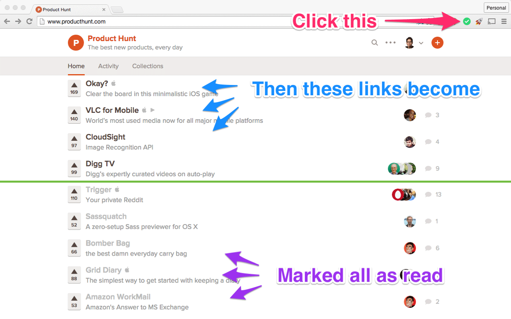

# MarkRead – Chrome Extension

One-click button to mark all the links on the page as read. This extension is an evolution of the one created by Kevin Xu but compatible with Chrome Manifest V3.

This styles all links to the a light grey color (customizable to the color of your choice) so you know what you've seen before and didn't want to click on. 

You can install this extension from the [Chrome Web Store](https://chrome.google.com/webstore/detail/MarkRead/leabfebnoebcmlcefkiehdnclldlghmi).

## Features

- Click the icon in the extensions bar to mark all links as read

## Notes

This extension uses `chrome.storage.local` to keep track of which links have been "marked as read" by adding any links styled by this extension to a persistent database of links. It does not add any entries to your browser history. The styling is persistent and will be re-applied when you revisit a page. This extension no longer uses the strategy of adding links to the browser history due to changes in Chrome browser behavior. Chrome defaults to allowing only links clicked from a top-level site and frame origin to be styled as visited by adding the link to the browser history. This will break the functionality of extensions that rely on adding links to the browser history, and a different strategy was needed.

To accommodate a potentially large history of links, this extension requests the `unlimitedStorage` permission so the storage limits of 10MB can be circumvented. This prevents you from running into storage limits. The extension also includes data management features in the options page, allowing you to prune old links and clear all data if you wish. This will limit the total number of links contained in the database to prevent slow down or performance issues.

## License

Mark All as Read is licensed under the [MIT License](LICENSE).
