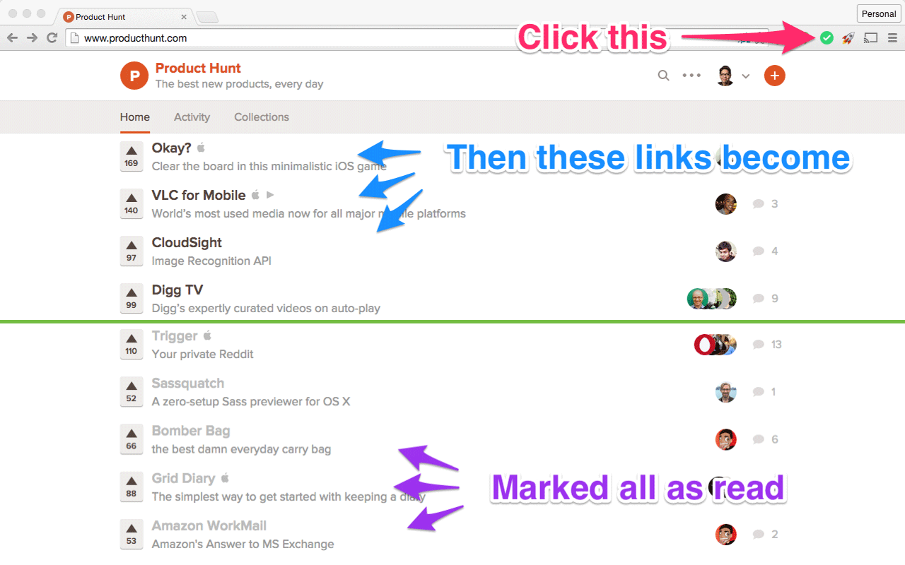

# MarkRead – Chrome Extension

One-click button to mark all the links on the page as read. This extension is an evolution of the one created by Kevin Xu but compatible with Chrome Manifest V3.

This turns all links to the `:visited` color so you know what you've seen before and didn't want to click on. 

You can install this extension from the [Chrome Web Store](https://chrome.google.com/webstore/detail/MarkRead/leabfebnoebcmlcefkiehdnclldlghmi).

## Features

- Click the icon in the extensions bar to mark all links as read

## Notes

This extension adds every single anchor tag to your Chrome history (this DOES NOT mean it clicks every link). The result is it can flood your Chrome history with lots of links.

## License

Mark All as Read is licensed under the [MIT License](LICENSE).
